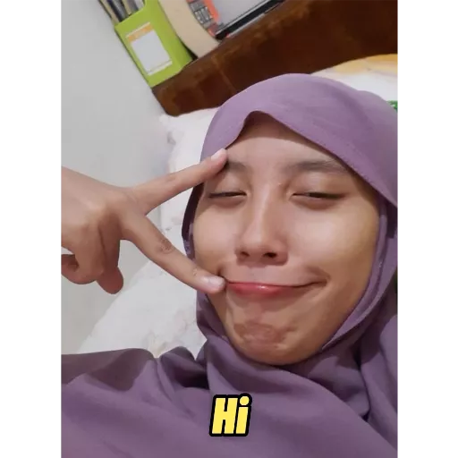

<h1 align="left"> bot-kenya-sensei-3 </h1>

 

    
    
Fitur bot-sensei versi 3.0 (discord.js)

    <ul>
        <li>Tambahan fitur pemutar musik (source youtube)</li>
        <li>Konfigurasi reply pesan menggunakan firebase database</li>
        <li>Menggunakan program discord.js v12</li>
    </ul>

 

    
Creator bot-sensei

    <ul>
        <li><a href="https://discord.com/users/453118970178961408">Model        : Kenya-sensei </a></li>
        <li><a href="https://discord.com/users/700723015360446564">Programmer   : Basyair </a></li>
    </ul>

